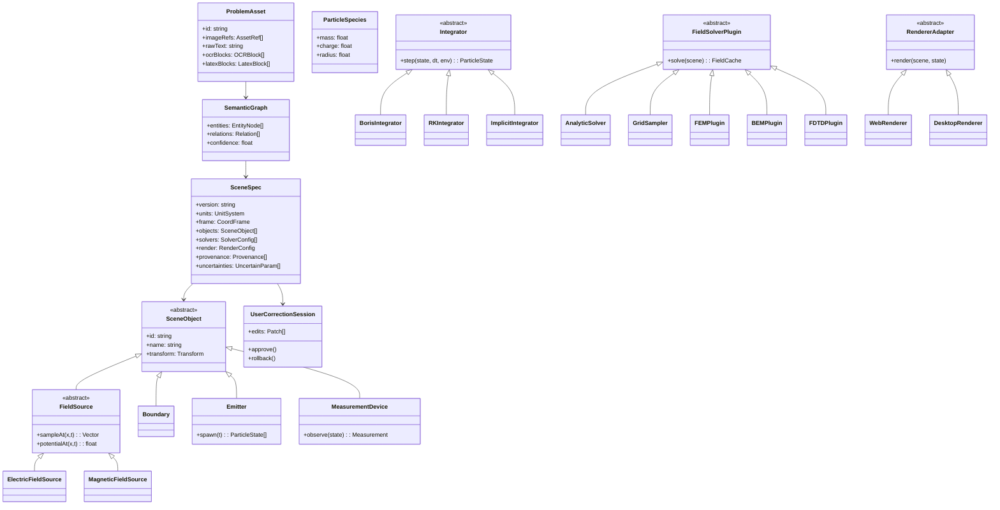

# 面向高中电磁场与带电粒子运动题目的可视化软件平台调研与架构报告

## 执行摘要

围绕“高中物理题，尤其是电磁场与带电粒子运动题”的产品目标，我的核心结论是：**首版系统不应把通用 FEM/FDTD/BEM 大型求解器当作中枢，而应采用“解析场基元 + 轻量采样场 + 结构保持粒子积分 + 重型数值求解插件化”的混合架构**。原因很直接：像 FEniCSx、MFEM、GetDP、openEMS、MEEP、Bempp 这类项目都很强，但官方定位明显偏向研究级 PDE / Maxwell / HPC / 大规模求解，常见依赖包括 PETSc、MPI、OpenCL、HDF5、Gmsh、GPU 后端等；它们非常适合作为**校验器、离线算例生成器、拓展插件**，但不适合作为课堂交互式题目演示平台的 MVP 核心。相反，SymPy 的解析能力、PlasmaPy 的 Boris 推进器、SciPy/OrdinaryDiffEq/Boost.odeint 的 ODE 能力，更接近“题目可视化 + 可交互演示”的核心诉求。这个结论属于工程判断，但它与各项目官方文档中体现的功能边界和依赖复杂度是一致的。 citeturn20search0turn20search8turn17search2turn17search1turn18search1turn18search2turn12search2turn11search14turn19search4turn16view0turn21search11turn2search0turn22view0turn26search8

如果目标是**同时支持 Web 与桌面原型**，我建议采用 **“共享 SceneSpec + 共享 Physics Core + 双壳层宿主”**：Web 端重点做课堂展示、浏览器交互、题目分享与在线批改；桌面端重点做教师备课、复杂 OCR/图像理解、离线模型调用、研究级数值插件接入。渲染层上，Web 首选 Three.js；桌面首选 PyQt + VisPy 或 PyVista/VTK。计算层上，粒子运动首选 Boris / Velocity-Verlet 这类结构保持方法，解析场优先以符号或闭式表达表示，数值 PDE 求解器一律下沉为插件。这样能把“教学流畅度”和“物理可信度”同时保住。 citeturn28search8turn28search2turn28search19turn39view3turn38search2turn21search11turn22view0turn2search0

从题目图片或题目描述自动生成场景，推荐采用 **“OCR/版面分析 → 公式检测与识别 → 几何与符号提取 → 物理量推断 → SceneSpec 生成 → 用户校正 → 仿真渲染”** 的流水线。中文支持上，优先级应是：**PaddleOCR / PP-StructureV3、CnOCR、CnSTD、RapidOCR** 处理文字与布局；**Pix2Text、UniMERNet、Paddle 的公式识别能力** 处理公式；**Qwen2.5-VL** 负责图文联合理解、局部定位与结构化 JSON 输出；**latex2sympy2_extended / SymPy parse_latex** 负责把公式转成可计算 AST。对文档级复杂试卷，**MinerU** 值得关注，但由于其当前为基于 Apache 2.0 的自定义许可证，进入商用或闭源分发前应做额外法务确认。 citeturn33search0turn33search11turn32view1turn34search0turn32view0turn32view2turn35view0turn33search1turn37search0turn10search1turn34search1turn34search2turn36search2turn36search4

## 调研结论与选型原则

从产品目标倒推，这个平台的“物理内核”应该服务于**题目表达**，而不是服务于“大而全的电磁仿真”。高中题里，高价值能力不是全波、多材料、多尺度 Maxwell 求解，而是：**可组合的场源、边界、粒子、探测器、标尺、势能/场线/矢量可视化，以及参数联动与轨迹解释**。因此，首版必须优先支持：点电荷、线电荷、圆环、平行板、均匀磁场、局域磁场区、速度选择器、质谱偏转区、屏幕探测器、绝缘/反射边界、初速度/入射角/电荷比等参数化组件；PDE 求解则作为“当题目超出解析组件覆盖范围时”的后备方案。这个判断与 SymPy、SciPy、PlasmaPy 对小中规模解析/数值问题的适配性，以及 FEniCSx、MFEM、MEEP、openEMS、Bempp 对研究型问题的定位相吻合。 citeturn20search0turn20search8turn2search0turn21search11turn17search1turn18search1turn19search4turn11search16turn16view0

推荐等级我使用如下标记：**S** 表示应进入 MVP 核心栈；**A** 表示应作为二阶段或插件保留；**B** 表示仅适合专项子问题；**C** 表示不建议作为首版核心。按这个标准，本报告的总体推荐是：**解析/规则层选 SymPy；粒子推进层选 Boris + RK/Implicit 组合；Web 渲染选 Three.js；桌面渲染选 VisPy 或 PyVista/VTK；OCR 主干选 PaddleOCR + CnOCR/CnSTD；公式识别选 Pix2Text/UniMERNet；图文联合理解选 Qwen2.5-VL；重型数值验证插件选 FEniCSx / MFEM / Bempp / openEMS / MEEP。** citeturn20search0turn21search11turn2search0turn28search8turn28search2turn28search19turn33search0turn32view1turn34search0turn32view2turn35view0turn37search0turn17search1turn18search1turn16view0turn11search16turn19search4

## 开源栈详细调研

推荐等级：**S = 核心；A = 强可选/插件；B = 专项；C = 首版不建议核心化**

### 电磁场数值求解

| 项目 | 方法/定位 | 语言/许可证 | 关键依赖 | 实时交互 / 前端嵌入 | 成熟度/示例 | 结论 | 依据 |
|---|---|---|---|---|---|---|---|
| SymPy | 解析场、向量微积分、标势/旋度/散度、公式化建模 | Python / BSD | 依赖轻；纯 Python 为主 | 实时：强（小规模）；前端嵌入：中（更适合作规则/解析层） | 成熟，文档完整 | **优**：非常适合解析场组件库、题干公式求值、单位和符号联动。**限**：不是网格 PDE 求解器。**推荐：S** | 官方文档/仓库 citeturn20search0turn20search8turn20search7 |
| FEniCSx | 通用 FEM，适合 Maxwell、波导、散射、耦合问题 | Python + C++ / LGPL-3.0-or-later | Basix、FFCx、UFL、mpi4py、NumPy；推荐 petsc4py；示例常配 Gmsh/PyVista | 实时：弱；前端嵌入：弱 | 成熟；有 Maxwell 散射、波导 demo | **优**：现代 variational API，适合做离线验证器与高级插件。**限**：依赖链长，MPI/PETSc 门槛高。**推荐：A** | DOLFINx 安装与 EM demo citeturn17search0turn11search0turn17search1turn17search13 |
| MFEM | 高性能 FEM，强调并行/GPU/高阶有限元 | C++ / BSD-3-Clause | 串行版几乎无外部依赖；并行版常用 hypre、METIS、MPI；支持 CUDA/HIP | 实时：弱；前端嵌入：弱 | 很成熟；有专门 electromagnetics miniapps | **优**：性能和可扩展性强，适合作离线样本生成器或高级求解插件。**限**：工程复杂度高，不适合作首版教学内核。**推荐：A** | 官网/仓库/EM miniapps/GPU 支持 citeturn40search1turn11search4turn18search1turn18search2turn18search5turn18search13 |
| GetDP | 混合 FEM，适合 de Rham 复形、EM/热耦合、静态/瞬态/谐波问题 | C / GPL-2.0-or-later | 常与 Gmsh/ONELAB 生态配合 | 实时：弱；前端嵌入：弱 | 成熟，长期文档在维护 | **优**：电磁学传统强项明显，适合作离线验证与研究扩展。**限**：脚本/对象模型对产品团队不如 Python 生态友好。**推荐：B** | 官方手册/开发版文档 citeturn12search2turn12search1 |
| openEMS | EC-FDTD，偏电磁时域仿真与几何建模 | C++，提供 Python 与 Matlab/Octave 接口 / GPL 系列 | CMake、Boost、HDF5、VTK、CGAL、Qt；配套 CSXCAD/AppCSXCAD | 实时：弱；前端嵌入：弱 | 成熟；文档完整，GUI 与脚本接口齐全 | **优**：FDTD + 几何/可视化工具链齐全。**限**：更偏工程/研究 EM 仿真，首版教学系统用它会显著增重。**推荐：B** | 官方文档/项目说明 citeturn11search14turn11search16turn11search11turn0search7 |
| MEEP | FDTD Maxwell，全波电磁仿真 | C++ / Python / Scheme / GPL | MPI、HDF5，部分功能依赖 MPB | 实时：弱；前端嵌入：弱 | 很成熟；跨 1D/2D/3D/柱坐标，有较多示例 | **优**：学术成熟度高，脚本化接口完整。**限**：目标更接近光子学/全波问题，而非高中题交互演示。**推荐：B** | 官方文档/仓库 citeturn19search0turn19search2turn19search4 |
| Bempp-cl | BEM，适合电势、声学、电磁边界积分问题；支持 FEM/BEM 耦合 | Python + 少量 C++ / MIT | NumPy、SciPy、Numba、meshio；可选 PyOpenCL、gmsh、ExaFMM | 实时：中（小规模）；前端嵌入：弱 | 文档完整；有 Laplace、Maxwell、FEM-BEM 耦合教程 | **优**：对电势/边界问题很有吸引力，可与 FEniCSx 耦合。**限**：BEM 本身对首版题库并非刚需。**推荐：A** | 官网/仓库/安装/教程 citeturn16view0turn16view2turn16view3turn15search1 |
| Bembel | 高阶等几何 BEM，支持 Laplace/Helmholtz/Maxwell | C++ / GPLv3 | Eigen、Octave NURBS、OpenMP | 实时：弱；前端嵌入：弱 | 有示例与 Doxygen | **优**：边界元方向技术含量高。**限**：对教学产品过重、生态较窄。**推荐：C** | 官方站点 citeturn16view1 |

**结论**：MVP 内核应以 **SymPy + 自研解析场组件** 为主；若要保留“研究级外插能力”，优先留 **FEniCSx / Bempp-cl / MFEM** 插件接口。FDTD 类的 openEMS/MEEP 不适合作首版中枢，但适合做“高保真离线样本工厂”。 citeturn20search0turn17search1turn16view0turn18search1turn11search16turn19search4

### 粒子运动积分

| 项目 | 方法/定位 | 语言/许可证 | 关键依赖 | 实时交互 / 前端嵌入 | 成熟度/示例 | 结论 | 依据 |
|---|---|---|---|---|---|---|---|
| SciPy `solve_ivp` | 默认 ODE 工具箱；显式 RK 与隐式 Radau/BDF/Lsoda | Python / BSD | NumPy、SciPy | 实时：中；前端嵌入：中（更适合作后端/桌面） | 极成熟 | **优**：工程友好，显式/隐式方法齐备。**限**：不以结构保持为核心，长时间轨道展示不如 Boris/辛法稳。**推荐：S（通用兜底）** | 官方文档 citeturn2search0 |
| Boost.odeint | 高灵活 C++ ODE 库；显式、辛积分等 | C++ / BSL-1.0 | 头文件库；与宿主容器/算术解耦 | 实时：强；前端嵌入：强（适合编译进 WASM） | 成熟；面向高性能 C++ | **优**：非常适合做共享 C++ 核心，然后同时绑定 Web/WASM 与桌面。**限**：对 Python 团队开发门槛高。**推荐：A** | 官方库页/仓库/项目站 citeturn26search2turn26search8turn24search3 |
| OrdinaryDiffEq.jl | 高性能 ODE/DAE 库；显式、隐式、SecondOrder、VelocityVerlet 等 | Julia / MIT | Julia SciML 生态 | 实时：强；前端嵌入：弱 | 很成熟；文档完整 | **优**：方法丰富，SecondOrderODE 和辛积分体验很好。**限**：若主栈不是 Julia，则引入新语言成本高。**推荐：B** | 仓库/许可/求解器文档 citeturn22view0turn23view0turn21search13 |
| PlasmaPy `ParticleTracker` / `BorisIntegrator` | 带电粒子在给定 E/B 网格中推进；Boris 为标准能量保持算法 | Python / BSD-3-Clause | PlasmaPy 生态；字段网格插值 | 实时：中；前端嵌入：中 | 成熟；文档与 notebook 示例齐全 | **优**：和本题目域高度贴合，Boris 直接可用。**限**：更适合桌面/后端，不直接面向前端浏览器。**推荐：S** | 官方 API/仓库 citeturn21search3turn21search11turn27view0 |
| GeometricIntegrators.jl | 几何积分、辛积分、变分积分统一接口 | Julia / MIT | Julia 生态 | 实时：强；前端嵌入：弱 | 成熟度中高 | **优**：适合做“长时间轨道守恒性”研究基准。**限**：同样受 Julia 语言栈限制。**推荐：B** | 文档/仓库/许可 citeturn26search4turn26search1turn21search6 |
| WarpX | PIC 代码；支持 Boris、Vay、Higuera-Cary 粒子推进 | C++ / BSD-3-Clause-LBNL | HPC/PIC 栈，GPU/多核并行 | 实时：弱；前端嵌入：弱 | 顶级研究级，极成熟 | **优**：可作为高端验证参考，方法学完整。**限**：过于重量级，不适合教学平台核心。**推荐：C** | 官方文档/仓库 citeturn25search2turn25search1 |

**结论**：产品核心应采用 **Boris + Velocity-Verlet + RK/Implicit fallback** 的三层方案：Boris 负责带电粒子主轨迹，Velocity-Verlet 负责部分二阶系统与教学演示，SciPy/OrdinaryDiffEq 负责特殊扩展问题。若考虑共用 Web/WASM 与桌面，可把 Boost.odeint 作为 C++ 共享核的候选。 citeturn21search11turn22view0turn2search0turn26search8

### 实时可视化

| 项目 | 方法/定位 | 语言/许可证 | 关键依赖 | 实时交互 / 前端嵌入 | 成熟度/示例 | 结论 | 依据 |
|---|---|---|---|---|---|---|---|
| Three.js | WebGL 3D 渲染基础库 | JavaScript / MIT | 浏览器 + WebGL | 实时：强；前端嵌入：强 | 非常成熟；文档与示例丰富 | **优**：最适合课堂网页、参数面板、场线/箭头/粒子轨迹动画。**限**：科学可视化原生数据结构不如 VTK 系。**推荐：S** | 官方 docs / 仓库 citeturn28search8turn5search7 |
| vtk.js | Web 端科学可视化 | JavaScript / BSD-3-Clause | npm 包；VTK/web 生态 | 实时：强；前端嵌入：强 | 成熟；官网即提供 API/Examples | **优**：更适合网格、切片、等值面、场数据。**限**：教学 UI 交互手感通常不如 Three.js 灵活。**推荐：A** | 官方站点/仓库 citeturn39view2turn29search6 |
| entity["company","Unity","game engine vendor"] 引擎 | 实时 3D/交互引擎 | C# / 商业许可为主，非开源 | Unity 编辑器与运行时 | 实时：强；前端嵌入：中（WebGL 可导出，但包体和管线较重） | 极成熟 | **优**：做高保真 3D 体验和游戏化教学很强。**限**：不是开源主栈，不利于共享学术代码与轻量前端。**推荐：B** | 官方产品页/文档 citeturn4search11turn4search17 |
| pythreejs | Jupyter 中的 Three.js 绑定 | Python / BSD-3-Clause | ipywidgets、Jupyter、three.js 绑定层 | 实时：中；前端嵌入：弱到中（偏 notebook） | 稳定；适合研究原型 | **优**：教师或研究者在 notebook 里快速原型很方便。**限**：不适合作为最终前端主渲染层。**推荐：B** | 官方文档/仓库 citeturn28search0turn39view1turn28search4 |
| VisPy | Python GPU/OpenGL 科学可视化 | Python / BSD-3-Clause | OpenGL；Qt/GLFW 等 backend；可选 jupyter_rfb | 实时：强；前端嵌入：中（桌面强，Web 弱） | 成熟；性能导向 | **优**：桌面原型极适合大粒子数、矢量场、交互图层。**限**：浏览器部署不直接。**推荐：S（桌面）** | 官网/安装文档 citeturn28search2turn39view0turn29search11 |
| PyVista | VTK 的 Python 友好封装 | Python / MIT | VTK；Jupyter/Qt 生态 | 实时：中到强；前端嵌入：中（PyQt 嵌入明确支持） | 成熟；文档好 | **优**：开发效率高，教师工作台和桌面原型很合适。**限**：底层 VTK 较重，不如 VisPy 轻。**推荐：A** | 官方文档/许可/Qt 嵌入说明 citeturn28search19turn29search1turn39view3 |
| VTK | 老牌科学可视化底座 | C++ / Python / BSD-3-Clause | VTK 全生态 | 实时：强；前端嵌入：中（桌面强，Web 需转 vtk.js/Trame 等） | 极成熟 | **优**：能力最全，适合高级后处理。**限**：首版教学产品开发成本较高。**推荐：A** | 官方站点/仓库 citeturn28search1turn29search2turn28search9 |

**结论**：**Web 端首选 Three.js，桌面端首选 VisPy，PyVista/VTK 作教师工作台与高级调试**。如果未来需要大量体渲染、网格切片或 FEM/BEM 结果浏览，再把 vtk.js/VTK 作为第二渲染通道接入。 citeturn28search8turn28search2turn39view3turn39view2

### 题目图像与文本解析

| 项目 | 作用 | 语言/许可证 | 关键依赖 | 实时交互 / 前端嵌入 | 成熟度/示例 | 结论 | 依据 |
|---|---|---|---|---|---|---|---|
| PaddleOCR / PP-StructureV3 | 中文优先 OCR、版面分析、结构化抽取 | Python / Apache-2.0 | Paddle 生态；文档解析模型链 | 实时：中；前端嵌入：中（更适合作服务） | 极成熟，支持 100+ 语言 | **优**：中文支持强，适合作试题页 OCR 主干。**限**：首版若全量引入文档解析能力，部署会偏重。**推荐：S** | 官方仓库/报告/README citeturn33search0turn33search11turn33search21 |
| Paddle 公式识别能力 | 打印体数学表达式到 LaTeX | Python / Apache-2.0 | PaddleOCR / PaddleX 公式管线 | 实时：中 | 有专门公式识别文档 | **优**：可与 PaddleOCR 文档管线统一。**限**：题图中的复杂、局部、噪声公式不一定是最优。**推荐：A** | 官方文档 citeturn9search3turn33search1 |
| CnOCR | 中文/英文 OCR | Python / Apache-2.0 | PyTorch；可接 CnSTD | 实时：中到强 | 成熟；20+ 模型、可直接用 | **优**：中文题干、小图块识别、快速本地部署都合适。**限**：对复杂整页结构还需配合版面分析。**推荐：S** | 官方仓库/README citeturn32view1turn30search0 |
| CnSTD | 文本检测、数学公式检测、布局分析 | Python / Apache-2.0 | PyTorch | 实时：中 | 已提供公式检测模型 | **优**：非常适合作“试题图片中公式区域/文字区域切分器”。**限**：只负责检测，不解决高层语义。**推荐：S** | 官方 README / setup 信息 citeturn34search0turn34search12turn34search16 |
| RapidOCR | 多语言、离线、ONNX 化 OCR 部署 | 多语言工具链；Python 常用 / Apache-2.0 | ONNX Runtime、OpenVINO、TensorRT 等可选 | 实时：强；前端嵌入：中（服务化/本地端都好） | 成熟；跨平台友好 | **优**：速度快、工程部署轻，适合本地或边缘端。**限**：复杂题图的结构理解仍需上层模型。**推荐：A** | 官方仓库/PyPI citeturn32view0turn31search16 |
| Pix2Text | 图片中的文本 + 公式 + 布局转 Markdown | Python / MIT | 内部整合 CnOCR 等 | 实时：中 | 成熟；80+ 语言 | **优**：对“题图变结构化文本”的产品价值很高，性价比极佳。**限**：对定制几何语义仍需后处理。**推荐：S** | 官方仓库/说明 citeturn32view2turn30search2turn30search10 |
| UniMERNet | 真实场景数学公式识别到 LaTeX | Python / Apache-2.0 | 模型较大；推荐单独服务 | 实时：中 | 官方 repo、数据集、GUI、paper 齐全 | **优**：对复杂公式、截图公式、手写/噪声场景更强。**限**：模型体量大于简单 OCR 方案。**推荐：S（公式专用）** | 官方 repo / paper citeturn35view0turn30search7 |
| MinerU | 整页文档解析，支持公式转 LaTeX、109 语言 OCR | Python / 自定义 MinerU Open Source License | 文档解析全链路 | 实时：中；前端嵌入：中 | 很成熟，文档级能力强 | **优**：整页试卷/讲义转结构化 Markdown 非常强。**限**：当前许可证为自定义条款，商用分发前应审查。**推荐：A** | 官方站点/仓库/论文/发布说明 citeturn36search0turn36search2turn36search1turn36search4 |
| SAM 2 | 可提示分割，适合图中装置/区域切分 | Python / Apache-2.0 + BSD-3-Clause 组件 | 视觉分割模型 | 实时：中到强 | 官方 repo + paper | **优**：适合分离磁场区域、屏幕、板极、导线等几何区域。**限**：不理解物理语义，需要上层提示与规则。**推荐：A** | 官方 repo / paper citeturn8search1turn8search9 |
| Grounding DINO | 开集目标检测/文本提示定位 | Python / Apache-2.0 | 视觉-语言检测模型 | 实时：中 | 官方 repo、论文齐全 | **优**：可用文本提示定位“平行板”“小球”“屏幕”“磁场区”。**限**：边框定位后仍需规则层校正。**推荐：A** | 官方 repo / paper / license citeturn8search2turn8search6turn34search7 |
| Qwen2.5-VL | 图文联合理解、目标定位、结构化 JSON 输出、文档解析 | 多尺寸视觉语言模型 / 开源模型卡与技术报告可得 | 推理资源取决于模型尺寸 | 实时：中（小模型可交互） | 技术报告与模型卡完善 | **优**：适合把“题图 + 题文 + OCR 结果”统一成语义图，并输出 bbox / 属性 JSON。**限**：需要用规则与用户校正抑制幻觉。**推荐：S（语义编排层）** | 官方博客 / 技术报告 / 模型卡 citeturn37search0turn10search1turn37search1 |
| `latex2sympy2_extended` + SymPy `parse_latex` | LaTeX → 可计算表达式 / AST | Python / MIT（前者）；SymPy 为 BSD | ANTLR 或 Lark 后端 | 实时：强 | 文档明确 | **优**：从 OCR/公式识别结果进入可计算物理表达式的关键桥梁。**限**：复杂向量记号、领域特化符号仍需自定义 grammar。**推荐：S** | 官方 repo / SymPy 文档 citeturn34search1turn34search9turn34search2turn34search10 |

**结论**：对“题目图片 → 场景”的首版流水线，我建议以 **PaddleOCR 或 CnOCR/CnSTD 做底层 OCR 与检测、Pix2Text/UniMERNet 负责公式、Qwen2.5-VL 负责语义拼装、latex2sympy2_extended/SymPy 负责公式落地**。若场景是整页试卷或讲义批量导入，再补上 MinerU。 citeturn33search0turn32view1turn34search0turn32view2turn35view0turn37search0turn34search1

## 模块化软件架构草案

建议采用 **“共享核心 + 多宿主 + 插件求解器 + 可校正解析流水线”**。核心思想是把产品拆成五层：**题目理解层、场景中间表示层、物理求解层、渲染适配层、交互校正层**。其中最关键的资产不是某个求解器，而是一个**稳定、可序列化、可版本化的 `SceneSpec`**。它要足够表达“题目条件”，也要足够表达“仿真状态”，同时还能保留 OCR/图像理解中的**不确定性与来源**，便于人工校正和回放。

我建议把可复用对象建成以下几类：`FieldSource`（电场/磁场/势函数/采样场）、`Boundary`（反射、吸收、绝缘、导体、屏幕）、`ParticleSpecies`、`Emitter`、`MeasurementDevice`（探针、屏幕、角度/时间/能量读数器）、`ScenarioTemplate`（质谱仪、速度选择器、回旋加速器等题型模版）、`Integrator`、`FieldSolverPlugin`、`RendererAdapter`、`ParserAdapter`。这些对象全部通过统一接口挂到 `SceneSpec` 上，由控制器协调。这样可以保证“题目文本生成的场景”和“手工搭建的场景”进入同一执行管线。



上图对应的工程要点有四个。其一，**数据格式**建议以 JSON Schema 为主、YAML 作为作者友好层、MessagePack/NPZ/Zarr 作为大数组缓存层；场和轨迹的结果不应直接塞回主 JSON，而应该以 `assetRef` 外挂，避免场线采样结果把场景文件膨胀。其二，**物理层必须区分解析场、采样场、重型求解场**：解析场用于大多数题目，采样场用于从插件求解器回填结果，重型求解场只在需要时才触发。其三，**粒子状态建议采用 Structure-of-Arrays**，便于 GPU/Numba/WebGL instancing；其四，**任何 OCR/图像推断出的参数都必须带置信度与来源**，并可在 UI 中被用户覆盖。

推荐的数据规范最少应包含以下字段：对象类型、坐标系、单位制、初始条件、约束、可调参数、题目来源、解析表达式、离散采样缓存、渲染样式、测量定义、用户补丁。特别重要的是 `uncertainties` 和 `provenance`：例如 OCR 把“2×10^-4 C”识别成“2×10^-1 C”时，系统要能在 UI 中把它标黄，而不是静默计算错误轨迹。

```ts
// 伪代码：统一的场景中间表示
type SceneSpec = {
  version: "scene-spec@1";
  dim: "2d" | "2.5d" | "3d";
  units: "SI";
  viewport: { xRange: [number, number], yRange: [number, number] };
  objects: Array<
    | ElectricFieldDef
    | MagneticFieldDef
    | BoundaryDef
    | EmitterDef
    | DetectorDef
    | AnnotationDef
  >;
  solver: {
    fieldMode: "analytic" | "sampled" | "plugin";
    particleIntegrator: "boris" | "velocity-verlet" | "rk45" | "radau";
    dt: number;
    maxSteps: number;
  };
  uncertainties: Array<{
    path: string;
    value: unknown;
    confidence: number;
    source: "ocr" | "vlm" | "rule";
    note?: string;
  }>;
};
```

关键接口建议如下。这里最重要的是：**场源对象永远暴露统一采样接口，求解器只是产生场源的一种方式**。这样前端不需要知道某个场来自解析公式、网格插值还是 FEM 插件。

```python
# 伪代码：物理核心接口
class FieldSource:
    def field_at(self, x, t=0.0): ...
    def potential_at(self, x, t=0.0): ...
    def sample_grid(self, bounds, resolution): ...

class PointChargeE(FieldSource):
    def __init__(self, q, pos, eps=8.854e-12): ...
    def field_at(self, x, t=0.0): ...
    def potential_at(self, x, t=0.0): ...

class UniformB(FieldSource):
    def __init__(self, Bvec, region=None): ...
    def field_at(self, x, t=0.0): ...

class ParticleIntegrator:
    def step(self, state, env, dt): ...

class BorisIntegrator(ParticleIntegrator):
    def step(self, state, env, dt): ...

class SceneEngine:
    def __init__(self, scene_spec):
        self.scene = build_scene(scene_spec)
        self.integrator = make_integrator(scene_spec.solver.particleIntegrator)

    def tick(self, state, dt):
        env = compose_fields(self.scene.field_sources)
        state = self.integrator.step(state, env, dt)
        state = apply_boundaries(state, self.scene.boundaries)
        measurements = [m.observe(state) for m in self.scene.measurements]
        return state, measurements
```

“从题目生成场景”的关键不是 LLM 文本生成，而是**规则优先、模型补全、用户确认闭环**。一个稳健的接口应该允许解析器产出半成品场景，并明确标出待确认字段。

```python
# 伪代码：从题目资源到场景
def build_scene_from_problem(asset: ProblemAsset) -> SceneSpec:
    ocr = ocr_pipeline(asset)
    formulas = formula_pipeline(asset, ocr)
    layout = layout_pipeline(asset, ocr)
    semantic_graph = multimodal_reasoner(asset, ocr, formulas, layout)
    draft = rule_based_scene_assembler(semantic_graph)

    draft.uncertainties.extend(find_ambiguous_values(ocr, formulas, semantic_graph))
    draft = normalize_units_and_symbols(draft)
    draft = attach_default_render_styles(draft)
    return draft
```

性能上，建议遵循三条硬规则。**第一，能解析就不网格；能局部采样就不全局采样；能增量更新就不整帧重算。** 第二，粒子和箭头/场线应分开更新频率：粒子 60 FPS，场线/矢量箭头 10–20 FPS 即可。第三，设计上预留 GPU 选项，但不把 GPU 作为首版必需：Web 先用 WebGL instancing + WASM 热点函数，桌面先用 NumPy/Numba，必要时再开 CUDA/VTK 高级通道。测试上，最重要的不是 UI 自动化，而是**物理回归测试**：回旋半径、回旋周期、纯磁场动能守恒、纯电场位能/动能互换、\(E \times B\) 漂移方向、边界碰撞时间、解析解对照误差、OCR 黄金集、截图回归，这些都应成为 CI 的固定资产。

## 从题目图片到可视化场景的处理流程

我建议把处理链拆成“**识别层、理解层、构造层、校正层**”四步，而不是试图一步到位让单个大模型直接吐场景 JSON。这样做的原因是：OCR 的错误、公式解析的错误、几何提取的错误，以及物理语义的错误，来源不同、修复方式也不同；分层后才能给用户可解释的校正界面。对中文试题尤其如此。 citeturn33search0turn32view1turn34search0turn32view2turn35view0turn37search0

| 阶段 | 目标 | 首选工具/模型 | 输出 | 适配建议 | 依据 |
|---|---|---|---|---|---|
| 文字 OCR | 识别题干、坐标标注、数值、单位 | PaddleOCR；CnOCR；RapidOCR | 文本框、置信度、行序 | 中文优先建议先 PaddleOCR 或 CnOCR；追求轻部署可选 RapidOCR | citeturn33search0turn32view1turn32view0 |
| 版面/区域检测 | 识别图区、文区、公式区、表格区 | PP-StructureV3；CnSTD；SAM 2；Grounding DINO | 区域框/掩码 | 题图中若结构不规整，SAM 2/Grounding DINO 更适合做辅助切分 | citeturn33search11turn34search0turn8search9turn8search6 |
| 公式检测与识别 | 把电场公式、半径公式、条件式转成 LaTeX | Pix2Text；UniMERNet；Paddle 公式识别 | LaTeX + 置信度 | 复杂公式优先 UniMERNet；整图混合内容优先 Pix2Text | citeturn32view2turn35view0turn33search1 |
| 图文联合理解 | 把“图中的板极/磁场区/屏幕/粒子”与题文绑定 | Qwen2.5-VL | 结构化 JSON、局部定位、属性 | 要求输出 schema，避免自由文本；把“未知/不确定”显式返回 | citeturn37search0turn10search1turn37search1 |
| 可计算表达式落地 | 把 LaTeX/文本公式转 AST/符号表达 | `latex2sympy2_extended`；SymPy `parse_latex` | AST、符号表、单位检查 | 对向量帽记号、下标物理量应加自定义 grammar | citeturn34search1turn34search2turn34search10 |
| 场景构造 | 生成 SceneSpec、默认样式与求解配置 | 规则引擎 + 模板库 | 草稿场景 JSON | 规则层必须先于 LLM 自由生成 | 综合上游能力推断 citeturn32view2turn37search0turn34search1 |
| 用户校正 | 把不确定信息暴露给教师/学生 | 自定义 UI | 确认后的 SceneSpec | 必做；这是产品可用性的关键 | 结合 OCR/VLM 不确定性推断 citeturn33search0turn37search0 |

具体交互流建议如下：题图导入后，界面显示三层覆盖物——**OCR 框层、几何层、物理语义层**。用户先确认数值和单位，再确认几何对象，再确认“哪一块是电场区/磁场区/屏幕/粒子发射点”。当系统无法确定图中某段箭头表示的是速度、受力方向还是电场方向时，必须以待确认状态显示，而不是偷偷推断。只有在用户接受草稿后，才进入场景生成与仿真。这样可以把“识别错”与“物理推错”明确分离，显著降低误导教学的风险。 citeturn32view1turn34search0turn35view0turn37search0

在模型选择上，我建议中文优先的最小可用组合是：**PaddleOCR/CnOCR + CnSTD + Pix2Text + Qwen2.5-VL + latex2sympy2_extended**。若处理对象是整页试卷、讲义或 PDF，则加上 **MinerU**；若题图中装置区域复杂、需要更强几何分割，再加 **SAM 2 / Grounding DINO**。其中 Qwen2.5-VL 不是用来直接“算物理”，而是用来做**定位、实体绑定、关系抽取与 JSON 结构化输出**。 citeturn33search0turn32view1turn34search0turn32view2turn37search0turn34search1turn36search2turn8search9turn8search6

## 路线对比与实施建议

| 维度 | Web 路线：TypeScript + WebGL/Three.js + WASM | 桌面/科研路线：Python + PyQt/VisPy/VTK + CUDA/Numba | 判断 |
|---|---|---|---|
| 主要价值 | 最适合课堂分发、浏览器访问、嵌入 LMS/题库系统、分享链接 | 最适合教师备课、复杂 OCR、模型本地跑、数值插件联调 | 两条路线都值得做，但角色不同 |
| 渲染能力 | Three.js 交互灵活；vtk.js 适合科学数据视图 | VisPy 用 GPU/OpenGL 做高性能交互；PyVista/VTK 适合科研可视化；Qt 可嵌入 OpenGL 小部件 | Web 更适合产品前台；桌面更适合工作台 | 
| 计算内核 | Emscripten 可把 C/C++ 编译到 Wasm，并支持 OpenGL→WebGL、C++/JS 绑定；适合把热点计算封装成共享核 | Numba 可把 CUDA Python JIT 到 PTX；本地 GPU 和 Python 生态接入更自然 | 若追求双端共享，最优是“C++ 核 + WASM + Python 绑定” |
| 部署与运维 | 部署最简单，升级快；对终端环境要求低 | 部署更重，但可离线、可本地模型、可访问本机 GPU | 教学触达面上 Web 明显更强 |
| OCR/文档解析接入 | 浏览器端能做轻量推理，但复杂 OCR/VLM 更宜走服务端 | 本地接模型和文件系统更方便，适合教师端或研究端 | 图片到场景的作者工具更适合桌面 |
| 性能上限 | 中高；适合中小规模轨迹、场线、参数滑条演示 | 高；适合大粒子数、离线生成、复杂插件求解 | 高强度数值任务优先桌面 |
| 教学适配性 | 学生零安装、老师可直接投屏、链接即用 | 教师与开发团队效率更高，但学生端部署成本大 | 教学产品主入口应是 Web |
| 开发成本 | 前端工程量大，但发布效率高；WASM 核需要 C++/Rust 经验 | Python 开发效率高，但跨平台分发与 UI 打磨更费力 | 如果团队前端强，Web 先行；如果团队科研强，桌面先行 |
| 综合建议 | **做最终用户产品前台** | **做教师/研发工作台与验证器** | **建议“双轨共享内核”** |

依据：WebAssembly 与 Emscripten 官方文档说明了 C/C++ → Wasm、OpenGL → WebGL 与 Embind 绑定；Three.js、vtk.js 适合浏览器交互；Qt 提供 OpenGL 小部件；VisPy 明确以 GPU/OpenGL 为核心；PyVista 文档明确支持嵌入 PyQt；Numba 文档明确支持 CUDA JIT。 citeturn38search4turn38search12turn38search3turn38search7turn28search8turn39view2turn38search2turn28search2turn39view3turn38search13

我的实施建议是：**产品形态上以 Web 为主，研发形态上以桌面为辅**。更具体地说，前 6 个月不要试图做成“两套完全不同的系统”，而是应做成：**一个共享的 SceneSpec；一个共享的 Physics Core；一个 Web Classroom；一个 Desktop Workbench。** Web 负责“用”，桌面负责“造”和“验”。这会比“纯 Web 一把梭”或“纯 Python 一把梭”更稳。 citeturn38search4turn28search8turn28search2turn39view3

## 里程碑计划

下面给出一个以 **同时支持 Web 与桌面原型** 为前提、偏务实的里程碑方案。时间以自然周估算，假设团队在前期以 4–6 人为宜：1 名前端/图形工程师、1 名 Python/仿真工程师、1 名 OCR/多模态工程师、1 名产品/交互工程师，外加可兼职的测试与课程顾问。

| 里程碑 | 时间估计 | 可交付物 | 人员/技能 | 主要风险 | 缓解措施 |
|---|---|---|---|---|---|
| 需求冻结与题型样本库 | 2 周 | 题型分层清单；20–50 道黄金样题；最小 SceneSpec 草案；成功指标 | 产品、物理教研、技术负责人 | 题型范围过大 | 先锁定二维平面题、匀强场/点电荷/速度选择器/磁偏转 |
| 核心数据模型与解析场内核 | 4 周 | `SceneSpec v1`；解析场组件库；Boris/RK 原型；单位与符号系统 | Python/物理引擎工程 | 核心模型反复返工 | 先只做 2D + SI + 可复用接口，不做全功能 GUI |
| Web 可视化 MVP | 4 周 | Three.js 场景渲染；粒子轨迹、场线、矢量箭头、势能热图；参数滑条 | 前端/图形工程 | 渲染与计算耦合过深 | 计算层和渲染层强制分仓；只通过 SceneSpec/状态快照通信 |
| 图片/文本到场景草稿 | 6 周 | OCR 管线；公式识别；语义抽取；场景草稿生成；不确定项标注 UI | OCR/多模态工程、前端 | 自动生成误差大 | 强制加入用户校正环节；建立 OCR 黄金集与人工回标流程 |
| 桌面工作台与插件接口 | 5 周 | PyQt/VisPy 或 PyVista 工作台；插件求解器接口；离线验证通路 | Python/桌面工程、数值工程 | Python GUI 与求解器集成复杂 | 先嵌入简化版渲染器，重型求解器异步任务化 |
| 教学模板与测量器件库 | 3 周 | 速度选择器、质谱仪、回旋运动、平行板偏转等模板；屏幕/探针/标尺组件 | 产品、前端、物理教研 | 模板太死板 | 模板只做场景初始化，不锁死参数与拓扑 |
| 测试、试教与首轮打磨 | 4 周 | 物理回归测试、截图回归、试教反馈、性能报告、安装/部署文档 | 全员 | 课堂场景中的易用性不足 | 邀请真实老师试教；把“纠错成本”列为核心指标 |

**总周期**：约 24–28 周可得到一套“能演示、能生成、能校正、能扩展”的双端原型。  
**首版硬目标**：不追求复杂 3D，不追求所有题型自动解析，而要追求**二维题高稳定覆盖 + 用户可修正 + 课堂可演示**。

风险优先级上，我认为最大的不在数值求解，而在**题图理解误差**与**产品交互负担**。因此，真正的首要工作不是继续堆求解器，而是建立三件基础设施：**黄金题库、误差标签体系、用户校正工作流**。只要这三件事做对，后面不管接 FEniCSx、Bempp 还是 openEMS，都只是“增加求解能力”；如果这三件事做错，再强的求解器都会被错误输入放大成错误教学演示。

## 开放问题与局限

本报告基于官方文档、开源仓库与原始论文做了高置信度筛选，但仍有三点需要在立项后尽快补实验。**第一**，本报告没有对这些 OCR/公式识别模型在“中文高中物理题图”这一特定数据分布上做统一基准测试，所以推荐更偏“架构适配性”而不是“你当前题库上的实测冠军”。**第二**，像 MinerU 的当前许可证、以及部分模型权重的具体使用条件，在进入商用、闭源分发或大规模 SaaS 部署前，需要再做一次法务复核。**第三**，Web 与桌面双端共享内核虽然技术上可行，但团队是否具备 C++/WASM 与 Python 双栈协同能力，会直接影响路线成本。相关风险在立项时应被视为一等公民。 citeturn36search4turn37search0turn38search4turn38search12

在没有进一步约束时，我给出的**最优建议**是：**先做二维、先做解析场、先做可校正流水线、先把教学闭环跑通；把重型数值求解、复杂 3D、全自动图像理解放到插件和第二阶段。** 这条路线最符合你提出的目标，也最符合现有开源生态各项目的真实边界。